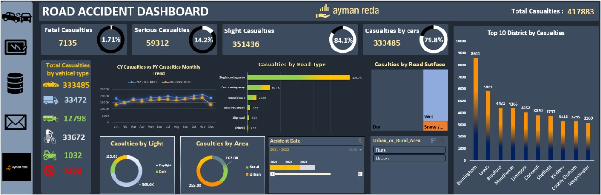

# 🚧 Road Accident Dashboard - Excel

This repository contains an interactive Excel dashboard built for analyzing road accident data.  
It highlights key patterns and insights such as:

## 📊 Dashboard Insights

- ✅ Total Casualties: 417,883
- 🛻 Casualties by vehicle type (cars, bikes, buses, etc.)
- 🛣️ Road type analysis (single, dual, roundabout...)
- 🌍 Area analysis: Urban vs Rural

- 🌙 Light conditions: Daylight vs Dark
- 📅 Yearly/monthly trends (2021 vs 2022)
- 📌 Top 10 districts with highest casualties

## ⚙️ Tools Used

- Microsoft Excel
- Pivot Tables
- Slicers & Charts
- Conditional Formatting
- Custom UI/Design

## 📥 Download & Usage

Simply download the `.xlsx` file and open it using Microsoft Excel 2016 or later.

## 📷 Dashboard Preview

## 🧠 Created By

**Ayman Reda**  
Data Analyst | Excel & Power BI Enthusiast  
📩 Connect with me on [LinkedIn](https://www.linkedin.com/in/aymanreda)

---

> ⭐ Star this repo if you found it useful or inspiring!
